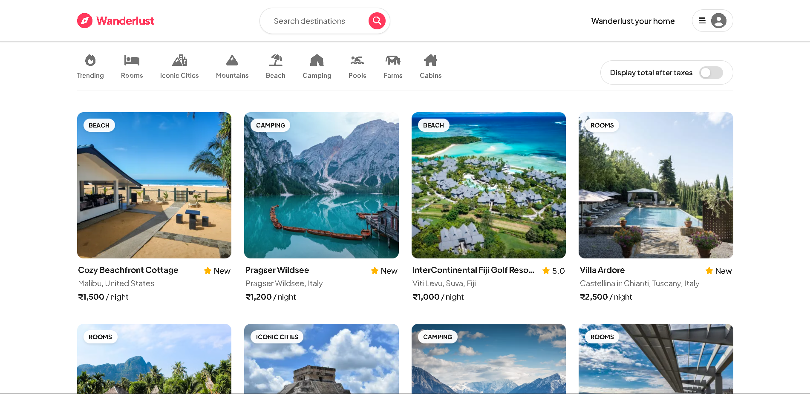
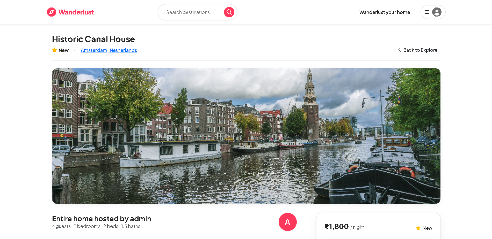
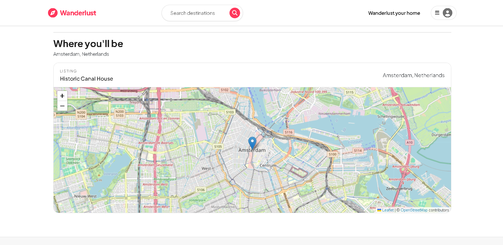
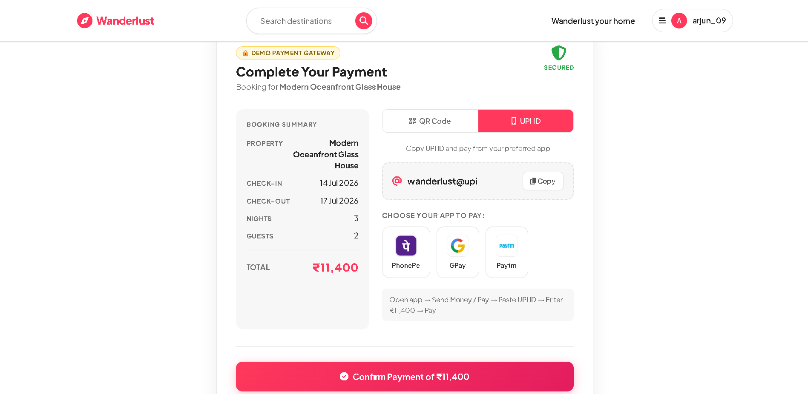

# 🏡 Wanderlust – Vacation Rental Booking Platform

An Airbnb-inspired **full-stack vacation rental booking platform** that enables users to explore, create, manage, and review vacation rental properties. Wanderlust provides a seamless booking experience with secure authentication, image uploads, interactive maps, and role-based authorization. Built using the **MVC architecture**, the project demonstrates modern web development practices with a focus on scalability, security, and responsive user experience.

---

## ✨ Features

### 🔐 Authentication & Authorization
- User Registration & Login
- Secure Authentication using Passport.js
- Session-based Authentication
- Password Hashing
- Protected Routes
- Role-based Authorization
- Flash Messages

### 🏠 Property Listings
- Browse all listings
- View detailed property information
- Create new listings
- Edit existing listings
- Delete owned listings
- Upload listing images
- Property categorization

### ⭐ Reviews & Ratings
- Add reviews
- Delete own reviews
- Rating system
- Display user reviews

### 🗺️ Location Services
- Interactive maps using Mapbox
- Geocoding support
- Property location visualization

### ☁️ Cloud Storage
- Image uploads with Multer
- Cloudinary image hosting
- Optimized image storage

### 📱 Responsive Design
- Mobile-friendly interface
- Bootstrap responsive components
- Clean and modern UI

### 🛡️ Security
- Server-side validation with Joi
- Authentication middleware
- Authorization middleware
- Secure session management
- Environment variable configuration

---

# 🚀 Tech Stack

### Frontend
- HTML5
- CSS3
- Bootstrap 5
- JavaScript (ES6)
- EJS

## Backend
- Node.js
- Express.js

### Database
- MongoDB
- Mongoose

### Authentication
- Passport.js
- Passport Local
- Express Session

### Cloud Services
- Cloudinary
- Multer
- Multer Storage Cloudinary

### Architecture
- MVC (Model View Controller)

---

# 📂 Project Structure

```text
Wanderlust/
│
├── controllers/
│
├── models/
│
├── routes/
│
├── public/
│   ├── css/
│   ├── js/
│   └── images/
│
├── views/
│   ├── layouts/
│   ├── listings/
│   ├── users/
│   ├── includes/
│   └── error.ejs
│
├── utils/
│
├── middleware.js
├── schema.js
├── cloudConfig.js
├── app.js
├── package.json
├── package-lock.json
└── README.md
```
---
## 📸 Project Preview

| Home | Listings |
|------|----------|
|  |  |

| Maps | Payment |
|------|----------|
|  |  |

## 🚀 Live Demo

🔗 [View Wanderlust Live](https://wanderlust-vacationrental-booking-qugt.onrender.com)
